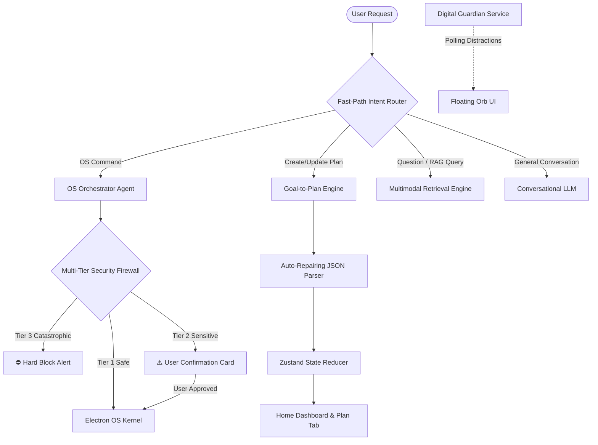
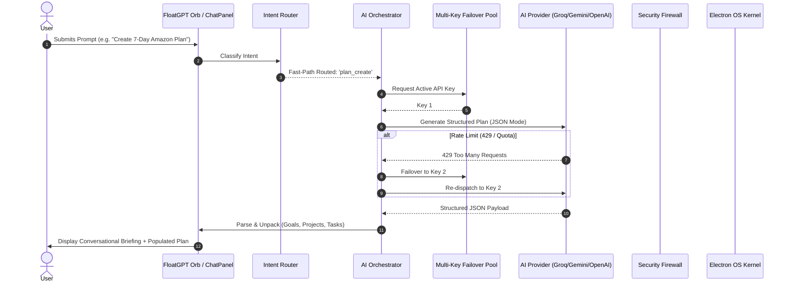

# FloatGPT: System Architecture & Feature Documentation

This document serves as the definitive reference guide to **FloatGPT**, detailing its core features, system architecture, multi-agent frameworks, security kernels, and backend infrastructure.

---

## 1. Executive Summary & Philosophy

**FloatGPT** is an enterprise-grade, distributed AI assistant built for both **Desktop (Electron)** and **Web (Playground Studio)**. Designed around the concept of **"Calm Execution"**, FloatGPT combines a minimalist, always-accessible floating desktop interface (the "Orb") with an omnipotent OS orchestrator, multi-tier security firewall, adaptive token optimizer, and a local-first state engine.

Unlike standard conversational wrappers, FloatGPT operates as an **autonomous agentic system** capable of:
1. Orchestrating the Windows OS securely via native PowerShell execution.
2. Generating structured hierarchical plans (Goals ➔ Milestone Projects ➔ Time-Boxed Tasks).
3. Enforcing productivity via background window activity monitoring (**Digital Guardian**).
4. Extracting and indexing multimodal documents into an ephemeral in-memory RAG pipeline.
5. Operating across a resilient **Multi-Key API Pool** with instant zero-delay rate-limit failovers.

---

## 2. Core Agents & Subsystems

### 2.1. Omnipotent OS Execution Agent & PowerShell Kernel
FloatGPT serves as an autonomous Windows orchestrator, converting user intents into verified PowerShell scripts:
- **Pure Stdin Script Execution**: Employs `spawn('powershell.exe', ['-Command', '-'])` in the Electron main process, eliminating command-line quote mangling and supporting complex multiline scripts.
- **Dual-Sync File Automation**: When creating or editing files (e.g., code snippets, notes), the agent simultaneously writes to disk via `Set-Content` and live-updates open editors (Notepad, Word) via `SendKeys` (`^a^v^s`) so users see changes immediately.
- **Smart Window & App Automation**: Detects existing application handles (e.g. WhatsApp Web or Desktop) and activates existing windows using Win32 API bindings rather than launching duplicate browser tabs.
- **Dynamic Path Normalization**: Resolves paths via `.NET` environment APIs (`[Environment]::GetFolderPath('Desktop')`), ensuring full compatibility with OneDrive folder redirections.

---

### 2.2. Enterprise Multi-Tiered Security Guard & Defense-in-Depth Firewall
Every OS command generated by the AI passes through a multi-pass security pipeline before execution:

| Threat Tier | Classification | Example Triggers | Action Taken |
| :--- | :--- | :--- | :--- |
| **Tier 3** | **Catastrophic / Malicious** | Drive formatting (`Format-Volume`), OS file deletion (`System32`, `Windows`), disabling Defender/Firewall, LOLBins (`certutil -urlcache`, `bitsadmin`, `mshta`), credential dumping (`mimikatz`, `SAM`), volume shadow deletion (`vssadmin`), reverse shells. | **Hard Block**: Execution is rejected immediately. Displayed as a red security warning card. |
| **Tier 2** | **Sensitive / Destructive** | File/folder deletion, renaming, process termination (`Stop-Process`, `taskkill`), registry modifications, power commands (`shutdown`), network alterations, global package installations (`npm -g`, `winget`). | **Confirmation Required**: Generates an interactive `SecurityPromptCard` with copyable code, parameters, and explicit **[ Confirm & Execute ]** / **[ Deny ]** controls. |
| **Tier 1** | **Safe & Benign** | Launching whitelisted apps, searching Google, querying system time, reading non-system files, manipulating volume, clipboard sync. | **Instant Execution**: Executed directly through the Electron runner. |

- **De-obfuscation Pipeline**: Strips backticks (`` ` ``), removes multiline `<# #>` and inline `#` comments, resolves string concatenations, and decodes Base64 `-enc` payloads before regex evaluation.
- **Main-Process Kernel Verification**: [`electron/osActionHandler.cjs`](file:///c:/Users/Mayank%20Garg/OneDrive/Desktop/Projects/FloatGPT/electron/osActionHandler.cjs) performs a secondary verification check at the OS boundary, ensuring commands cannot be executed even if the frontend renderer is bypassed.
- **URL & Protocol Sanitization**: Enforces strict `http:` and `https:` protocol validation in `openUrl`, blocking dangerous URI schemes (`javascript:`, `file:`, `data:`, `vbscript:`).

---

### 2.3. Digital Guardian (Focus & Discipline Enforcer)
FloatGPT runs an active background Windows polling service ([`electron/guardian.cjs`](file:///c:/Users/Mayank%20Garg/OneDrive/Desktop/Projects/FloatGPT/electron/guardian.cjs)) to keep users focused during execution mode:
- Polls active window titles at configurable intervals against a customizable distraction blocklist (e.g. gaming apps, social media feeds).
- Upon detecting a distraction during active focus sessions, the floating Orb triggers an aggressive **Framer Motion visual override** (shaking and pulsating red aura) to guide user focus back to current milestones.

---

### 2.4. Structured Goal-to-Plan Engine & Auto-Repairing Parser
When users request plans (e.g., *"Create a 7-day Amazon interview plan with alarms and todos"*), FloatGPT initiates a dedicated structured mutation loop:
- **Hierarchical Schema**: Generates 1 Goal (`newGoals`), 2–4 Milestone Projects (`newProjects`), and 5–15 Time-Boxed Tasks (`newTasks`) complete with priorities, estimated effort, and exact ISO timestamps.
- **Tool Isolation**: Disables OS tool execution during planning turns to guarantee 100% adherence to strict JSON formatting.
- **Auto-Repairing JSON Engine**: If an LLM response is cut off or malformed, [`src/ai/validation/response.ts`](file:///c:/Users/Mayank%20Garg/OneDrive/Desktop/Projects/FloatGPT/src/ai/validation/response.ts) automatically balances quotes, closes unclosed brackets/braces, and extracts the conversational summary without crashing.
- **Live State Sync**: Unpacks structured plans into Zustand state, immediately populating the **Mission Control Dashboard (`HomePanel.tsx`)** and **Plan View (`PlanPanel.tsx`)**.

---

### 2.5. Multimodal Ingestion & Session-Scoped RAG Pipeline
FloatGPT features a client-side document processing engine that extracts, chunks, and indexes knowledge without cloud storage overhead:
- **Dual-Engine PDF Parser**: Primary extraction via `pdfjs-dist` local worker, backed by a native **binary stream text extractor** fallback that decodes PDF content streams (`BT ... ET`, `Tj`, `TJ`) even under strict CSP or offline environments.
- **MiniSearch Full-Text Search**: Text documents, PDFs, and code files are split into overlapping chunks and indexed into a local `minisearch` vector/keyword index for instant semantic grounding.
- **Ephemeral Session Isolation**: Extracted knowledge remains active in memory for the duration of the chat session, while heavy binary files and raw documents are strictly excluded from remote Firestore persistence, preventing 1MB document quota overflow.
- **Upload Manager UI**: Interactive knowledge cards featuring real-time ingestion status indicators and 1-click removal controls.

---

### 2.6. Multi-Key API Pool & Instant Rate-Limit Failover
To eliminate API interruptions and rate-limit roadblocks:
- **Dynamic Key Pool Discovery**: Automatically aggregates all configured keys from `.env` (`VITE_GROQ_API_KEY`, `VITE_GROQ_API_KEY_2` through `VITE_GROQ_API_KEY_20`, Google Gemini, and OpenAI).
- **0ms Instant Rate-Limit Failover**: When a key encounters a `429 Too Many Requests`, TPM limit, or quota error, the runner rotates to the next available key in the pool with zero delay.
- **User vs Developer Isolation**: User-configured keys in Settings take primary priority, while local `.env` keys act as a resilient fallback pool.

---

### 2.7. Precision Token Optimization Engine
FloatGPT minimizes token overhead while maintaining high output reasoning depth:
- **Fast-Path Intent Router**: Instant regex categorization for 95%+ of common intents, bypassing LLM routing calls (**0 tokens & 0ms latency**).
- **Multi-Turn Attachment Stripper**: Strips base64 image data from older history turns, preventing thousands of tokens from being re-sent on every follow-up.
- **History JSON Cleaner**: Replaces historical structured JSON payloads with conversational summaries in conversation memory.
- **State Compressor**: Filters out completed/archived tasks and caps active tasks to the top 20 urgent items before assembling prompts.
- **Dynamic Token Floors**: Automatically scales token ceilings (1,024 tokens for quick chat; 4,096 tokens for multi-day plans).

---

## 3. Technology Stack

| Layer | Technology |
| :--- | :--- |
| **Frontend Framework** | React 19, Vite, Tailwind CSS v4, Framer Motion |
| **Desktop Wrapper** | Electron 33 (with sandboxed IPC bridging and DPI-scaled window constraints) |
| **State & Persistence** | Zustand (Reactive UI), `idb-keyval` (IndexedDB Local-First), Firebase Firestore (Cloud Sync) |
| **AI Providers** | Groq (Llama 3.3 70B, GPT OSS 120B), Google (Gemini 2.0 / 1.5), OpenAI (o3-mini, GPT-4o), Anthropic (Claude 3.7 Sonnet) |
| **Local Search & RAG** | MiniSearch (Client-side full-text search index), Custom Text Chunker |
| **Document Processing** | `pdfjs-dist` with native binary stream fallback parser |
| **Backend & Workers** | Express / Node.js, Upstash Redis (L2 Cache), Upstash Kafka (Async Summaries) |

---

## 4. Architectural Data Flow

---

## 5. Security & Operating Guidelines

1. **Strict Surface Separation**: The Electron Desktop Orb and Playground Web Dashboard share the memory layer but maintain independent conversation transcripts.
2. **Local-First Reliability**: Reads and writes always hit IndexedDB first for instant UI response before syncing to Firebase.
3. **No Destructive Bypasses**: Destructive OS operations must always be verified by the user via interactive security prompt cards.
4. **Session Ephemeral RAG**: Ingested document chunks remain available for the current chat session without burdening remote cloud storage.

---

*FloatGPT is engineered for speed, architectural resilience, and enterprise-grade execution.*

