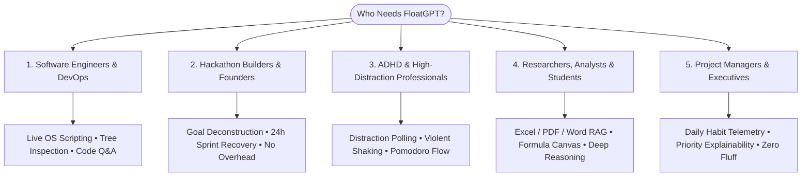
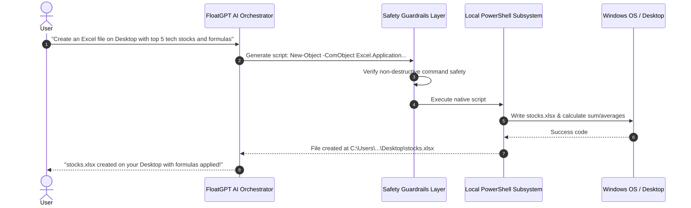
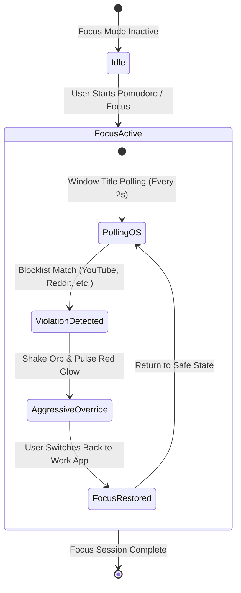
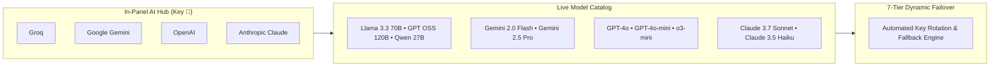
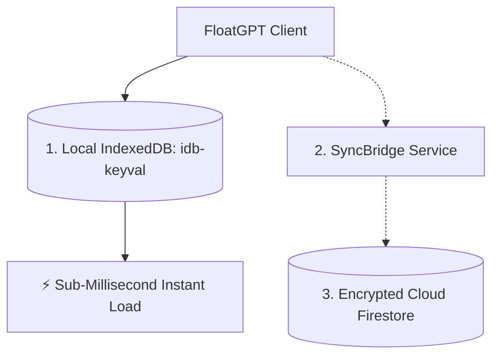

<div align="center">
  
  <br />
  <h1>FloatGPT — Feature & Capability Master Atlas</h1>
  <p><b>Version 2.1.1 • Comprehensive Architectural, System & Feature Specification</b></p>
  <p><i>The Autonomous, Omnipotent OS Companion for Calm Execution, Deep Focus & Desktop Automation</i></p>
</div>

---

## 📑 Master Table of Contents

1. [🧭 Mission & Core Philosophy](#1--mission--core-philosophy)
2. [👥 Who Is FloatGPT For? (Target Personas & Use Cases)](#2--who-is-floatgpt-for-target-personas--use-cases)
3. [⚙️ Native OS Automation & Desktop Control Engine](#3-️-native-os-automation--desktop-control-engine)
4. [📅 Goal, Project & Task Planning Engine](#4--goal-project--task-planning-engine)
5. [🛡️ Digital Guardian, Focus Enforcer & Pomodoro Suite](#5-️-digital-guardian-focus-enforcer--pomodoro-suite)
6. [🎨 Screen Canvas & Live Drawing Overlay](#6-️-screen-canvas--live-drawing-overlay)
7. [🔑 Universal In-Panel AI Hub & Multi-Model Architecture](#7--universal-in-panel-ai-hub--multi-model-architecture)
8. [📄 Enterprise Document RAG & Multimodal Vision Engine](#8--enterprise-document-rag--multimodal-vision-engine)
9. [🌐 The Playground Studio & Habit Analytics](#9-️-the-playground-studio--habit-analytics)
10. [🧠 Shared Memory Layer & Context Continuity](#10--shared-memory-layer--context-continuity)
11. [⌨️ Slash Commands, Global Hotkeys & Voice Dictation](#11-️-slash-commands-global-hotkeys--voice-dictation)
12. [🎛️ Settings, Appearance & Customization Matrix](#12-️-settings-appearance--customization-matrix)
13. [🔒 Security, Safety Guardrails & Local-First Storage](#13--security-safety-guardrails--local-first-storage)

---

## 1. 🧭 Mission & Core Philosophy

Traditional productivity software is passive: it sits as a static tab in your browser, accumulates stale backlog items, and displays a wall of red overdue alerts when you fall behind—triggering anxiety instead of driving action.

**FloatGPT** is fundamentally different:
- **It is an Execution Control Plane**: Docked directly onto your desktop as a lightweight, interactive floating Orb that summons instantly anywhere via `Ctrl + Shift + Space`.
- **It is Omnipotent & Native**: It directly interfaces with your local operating system—creating spreadsheets, drafting documents, inspecting disk usage, and launching native applications via dynamically generated PowerShell scripts.
- **It is Self-Healing**: When deadlines slip, the **Autonomous Recovery Engine** reschedules non-critical work to protect your hard deliverables.
- **It Protects Attention**: The **Digital Guardian** actively polices distraction windows during Focus Mode, forcefully shaking the Orb and pulsing red alerts to drag you back to execution.
- **Design Standard**: Built for *"Calm Execution"*—no fake terminal theatrics, high-contrast readability, glassmorphic styling, and physics-driven animations.

---

## 2. 👥 Who Is FloatGPT For? (Target Personas & Use Cases)



### 1. 💻 Software Engineers, DevOps & Architects
- **Context-Switch Elimination**: Run shell commands, inspect directory file sizes, count subfolders, or open settings without leaving your code editor.
- **Universal Documentation & RAG**: Drop dense API specs or PDF documentation into FloatGPT to query schemas, edge cases, and architectures instantly.
- **Zero-Friction Hotkey**: Tap `Ctrl + Shift + Space` to summon technical solutions over any IDE or terminal.

### 2. ⚡ Hackathon Competitors, Agile Builders & Startup Founders
- **Natural Language Sprints**: Type *"I have 4 hours left: build demo, deploy backend, record video, submit README"*, and get a minute-by-minute execution timeline.
- **Self-Healing Recovery**: If step 1 takes 40 minutes longer than planned, FloatGPT recalculates your entire schedule without panic.
- **Deterministic Urgency ("Why?" Button)**: Clearly explains which task must be executed right now and why non-critical tasks were deferred.

### 3. 🎯 High-Output Knowledge Workers & Individuals with ADHD / Focus Challenges
- **Active Distraction Enforcement**: Background monitoring detects when you open distracting tabs (YouTube, Twitter/X, Reddit) during Focus sessions and forcefully shakes the Orb to break dopamine loops.
- **Conversational Firewall**: FloatGPT politely rejects idle small talk, persistently redirecting your attention back to your active task.
- **Visual Urgency Progression**: Dynamic color shifts (Safe Blue ➔ Watch Amber ➔ Warning Orange ➔ Critical Red).

### 4. 📚 Researchers, Financial Analysts & Academic Students
- **Deep Spreadsheet & Document Manipulation**: Create `.xlsx` spreadsheets, calculate averages and sums, insert Excel formulas, and format tables via conversational prompts.
- **Multimodal Visual Canvas**: Annotate lecture notes, code snippets, or financial graphs directly on screen using the **Screen Canvas Overlay**.
- **Historical Memory Retention**: Long-term context extraction stores formulas, preferences, and recurring research themes without bloating individual chat transcripts.

---

## 3. ⚙️ Native OS Automation & Desktop Control Engine

FloatGPT's **Omnipotent OS Agent** gives the Cloud AI direct, sandboxed tool access to execute PowerShell scripts on your local system on-the-fly via `window.electronAPI.flow.executeScript`.



### Key OS Automation Capabilities:

* **📁 File Creation & Document Authoring**:
  * **Text Files (`.txt`, `.md`, `.json`, `.csv`)**: Creates, reads, appends, and updates files across any accessible OS directory.
  * **Excel Spreadsheets (`.xlsx`)**: Dynamically writes tables, calculates sums/averages, applies custom formulas, sorts rows, and formats financial datasets.
  * **Word Reports (`.docx`)**: Generates structured summary documents and executive reports with headings and bullet points.
* **🌳 Directory Tree & Storage Inspection**:
  * **Tree Exploration**: Explores depth-based directories (`Get-ChildItem -Depth 2`), counts folders and files, and maps directory structures.
  * **Large File Discovery**: Scans and identifies the largest storage-consuming files and applications on your hard drive.
  * **Desktop Path Resolution**: Dynamically resolves `[Environment]::GetFolderPath('Desktop')` across localized Windows environments.
* **🖥️ Application & Window Control**:
  * Launches native Windows UWP apps (Calculator, Notepad, Spotify, VS Code, Windows Terminal, Slack, etc.).
  * Opens Windows Settings panels, Sound settings, Network properties, and Control Panel applets.
  * Adjusts master system volume (`[Audio]::SetMasterVolume`) or toggles mute states.
* **🛡️ Destructive Command Interceptor (Security Layer)**:
  * Intercepts dangerous operations (`Remove-Item`, `del`, `format`, `rmdir`, `Drop-Database`).
  * Safety prompts require explicit user confirmation before executing potentially destructive actions.

---

## 4. 📅 Goal, Project & Task Planning Engine

FloatGPT's planning system transforms loose intentions into mathematically prioritized action plans.

```
Goal: "Ship v2.1.1 Release"
 │
 ├── Project A: "Frontend & Canvas Polish" (Progress: 100%)
 │    ├── [Completed] Task 1: Refactor Quick API Modal to 380px Frame
 │    └── [Completed] Task 2: Implement Smooth Canvas Stroke Smoothing
 │
 └── Project B: "AI Hub & Failover Integration" (Progress: 85%)
      ├── [In Progress] Task 3: 7-Tier Key Rotation Fallback Engine
      └── [Planned] Task 4: Verify Multimodal Vision Token Limits
```

### Planning Engine Features:
- **Natural Language Breakdown**: Speak or type a broad goal; FloatGPT decomposes it into Projects, Subtasks, and time-zone-aware deadlines.
- **Time & Urgency Engine**:
  - Computes real-time Unix timestamp countdowns.
  - **4-Stage Visual Urgency**:
    - `🟢 Safe` (Due in > 24 hours)
    - `🟡 Watch` (Due in 6 – 24 hours)
    - `🟠 Warning` (Due in 1 – 6 hours)
    - `🔴 Critical` (Due in < 1 hour)
- **Autonomous Recovery Engine**: Automatically defers "soft" non-critical tasks to tomorrow when high-priority hard deadlines are endangered by delays.
- **Explainability ("Why?" Engine)**: Transparent inline reasoning reveals why a specific task is placed at the top of your queue.
- **Interactive Kanban & Timeline**: Drag-and-drop status transitions (Inbox ➔ Planned ➔ Active ➔ In Progress ➔ Completed ➔ Archived).

---

## 5. 🛡️ Digital Guardian, Focus Enforcer & Pomodoro Suite

The **Digital Guardian** is a persistent background Windows service (`electron/guardian.cjs`) engineered to eliminate procrastination.



### Guardian & Focus Capabilities:
* **Real-Time Distraction Polling**: Scans active foreground window titles against a configurable blocklist (`youtube.com`, `reddit.com`, `twitter.com`, `instagram.com`, `netflix.com`, etc.).
* **Violent Physical Bounds Override**: Upon detecting a distraction violation during Focus Mode, the Orb violently shakes on your screen and pulsates an intense neon red glow (`drop-shadow: 0 0 15px rgba(255,0,0,0.8)`).
* **Extreme Deadline Sentinel (`[-10m, +10m]`)**: Triggers un-dismissible high-contrast urgency notifications when tasks cross critical deadline thresholds.
* **Mathematical Pomodoro Engine**:
  * Configurable Work (25m), Short Break (5m), and Long Break (15m) cycles.
  * Audio alerts and progress rings.
  * Synchronized between Desktop and Playground Studio.
* **Zero-Lag Emergency Cloud Notification**:
  - 10-second priority bubble for task reminders.
  - Instant 1-click dismissal (`X`) with zero UI latency and full 380px non-clipped bounds.

---

## 6. 🎨 Screen Canvas & Live Drawing Overlay

The **Screen Canvas** turns your entire display into an interactive digital whiteboard.

```
┌──────────────────────────────────────────────────────────┐
│  [Freehand]  [Arrow]  [Highlighter]  [Line]  [Eraser]    │
│  Colors: (🔴 Red Alert) (🔵 Cyber Blue) (🟢 Emerald)    │
│  Stroke: ────●───────── (3px)   [Clear Canvas]  [Close]  │
└──────────────────────────────────────────────────────────┘
```

### Canvas Capabilities:
* **Summon Instantly**: Click the **Paintbrush (🖌️)** icon in the header / docked toolbar, or type `/draw` in chat.
* **Full Multi-Tool Palette**:
  * **Pen**: Freehand sketching with pressure-smooth interpolation.
  * **Arrow**: Click-and-drag directional arrows for bug callouts and architectural diagrams.
  * **Highlighter**: Semi-transparent yellow/cyan overlay for text emphasis.
  * **Straight Line**: Crisp wireframe and layout drawing.
  * **Eraser & Clear**: Point-by-point erasing or instant 1-click canvas clearing.
* **Zero-Interference Overlay**: Floats on top of IDEs, web browsers, terminal sessions, or presentation decks without intercepting underlying clicks when disabled.

---

## 7. 🔑 Universal In-Panel AI Hub & Multi-Model Architecture

FloatGPT v2.1.1 features an embedded **AI Provider & Model Selection Hub** built directly into the native 380px frame (`w-[380px] h-[560px]`).



### Supported AI Providers & Frontier Models:

| Provider | Supported Models | Recommended Use Case |
| :--- | :--- | :--- |
| **Groq** | `llama-3.3-70b-versatile`<br>`openai/gpt-oss-120b`<br>`openai/gpt-oss-20b`<br>`qwen/qwen3.6-27b`<br>`llama-3.1-8b-instant` | Ultra-fast sub-second OS automation, code generation & conversational reasoning. |
| **Google Gemini** | `gemini-2.0-flash`<br>`gemini-2.5-pro`<br>`gemini-1.5-flash`<br>`gemini-1.5-pro` | Multimodal image/PDF vision analysis, massive context extraction & deep research. |
| **OpenAI** | `gpt-4o`<br>`gpt-4o-mini`<br>`o3-mini` | Complex algorithmic reasoning, high-precision planning & general intelligence. |
| **Anthropic** | `claude-3-7-sonnet-20250219`<br>`claude-3-5-haiku-20241022` | Flawless prose, nuanced document summarization & advanced coding tasks. |

### AI Hub Capabilities:
- **1-Click Live Validation**: Test API keys with instant visual checkmarks before saving.
- **7-Tier Dynamic Failover Pool**: Automatically cycles through backup API keys and fallback providers when rate limits (`429`) or quota caps are hit.
- **Show/Hide Key Toggle & Clipboard Paste Helper**: Secure and fast key entry.

---

## 8. 📄 Enterprise Document RAG & Multimodal Vision Engine

FloatGPT features a local-first **Retrieval-Augmented Generation (RAG)** pipeline powered by MiniSearch and token-budgeted semantic extraction.

```
[Drop File: .pdf / .docx / .xlsx / .csv / .png]
          │
          ├── Semantic Extraction & Chunking (Max 800 Tokens/Chunk)
          ├── BM25 / MiniSearch Inverted Indexing
          └── Context Compression (Intelligently strips base64 from small LLMs)
          │
     Query Grounding: AI cites exact sections & spreadsheet rows
```

### Document Capabilities:
* **Supported File Types**: `.pdf`, `.docx`, `.xlsx`, `.csv`, `.txt`, `.md`, `.json`, `.png`, `.jpg`, `.webp`.
* **Spreadsheet Intelligence**: Parses row-and-column structures from `.xlsx`/`.csv` for precise numerical queries.
* **Token-Per-Minute (TPM) Guardrails**: Intelligently separates high-resolution base64 images from prompt tokens when routing to Groq/Llama models, preventing rate limit errors while feeding visual context to Gemini/GPT-4o.

---

## 9. 🌐 The Playground Studio & Habit Analytics

Accessible from any web browser (`https://floatgpt.vercel.app`), the **Playground Studio** is your companion analytics and telemetry dashboard.

```
┌────────────────────────────────────────────────────────────┐
│                    FLOATGPT PLAYGROUND                     │
│  [Playground Chat]  [Analytics]  [Memories]  [Download]    │
├───────────────────────────┬────────────────────────────────┤
│  📊 Execution Analytics   │  🧠 Shared Long-Term Memories  │
│  • Completion Rate: 94%   │  • Prefers TypeScript & React  │
│  • Plan Accuracy: 91%     │  • Focus Window: 09:00 - 13:00 │
│  • Avg Delay: 8.2 mins    │  • Hard Deadline: Friday 17:00 │
└───────────────────────────┴────────────────────────────────┘
```

### Playground Studio Capabilities:
* **Live Habit Telemetry**:
  * **Completion Rate (%)**: Measures task follow-through over time.
  * **Plan Accuracy (%)**: Tracks estimated vs. actual execution duration.
  * **Procrastination Hotspots**: Identifies times of day with highest distraction rates.
  * **Peak Focus Window**: Pinpoints your most productive hours.
* **Isolated Transcripts**: Chat freely in the Playground without altering or bloating your Desktop Orb's active execution chat history.
* **Shared Memory Viewer**: Browse, edit, or prune the memories stored in your intelligence layer.

---

## 10. 🧠 Shared Memory Layer & Context Continuity

FloatGPT maintains a **Unified Memory Layer** that learns your habits and preferences across sessions.

* **Automatic Reflection Extraction**: Distills key insights from completed tasks and conversations (*"User prefers concise code with TypeScript annotations"*, *"User has hackathon demo at 4 PM"*).
* **Cross-Surface Sync**: Memories created in the Desktop Orb are immediately accessible in the Web Playground, and vice versa.
* **Transcript Decoupling**: Transcripts remain localized to prevent token bloat, while high-value insights are promoted to the permanent memory store.

---

## 11. ⌨️ Slash Commands, Global Hotkeys & Voice Dictation

FloatGPT is built for speed, offering multiple high-velocity input methods.

### 1. Slash Commands (/)
Type `/` in any chat box to trigger macro routines:
- `/plan [objective]` — Automatically generates projects, milestones, and prioritized tasks.
- `/summarize` — Generates a concise executive brief of the active conversation.
- `/explain [concept]` — Provides deep, step-by-step technical explanations.
- `/diagram [flow]` — Generates interactive Mermaid diagrams.
- `/table [data]` — Structures complex comparisons into clean markdown tables.
- `/draw` — Immediately activates the Screen Canvas overlay.

### 2. Global Hotkeys
- **`Ctrl + Shift + Space` (The Boss Key / Quick Summon)**:
  - When FloatGPT is hidden ➔ Instantly summons the assistant directly into Chat mode.
  - When FloatGPT is visible ➔ Instantly conceals the assistant to clear your screen.
  - **Sleep-Wake Resilience**: Automatically re-registers OS hooks upon laptop sleep/wake cycles.

### 3. Voice Dictation
- Built-in Web Speech API integration (`Microphone` button) allows effortless voice prompting without typing.

---

## 12. 🎛️ Settings, Appearance & Customization Matrix

FloatGPT gives you granular control over visual aesthetics and system behavior.

```
Settings Panel (⚙️)
 ├── General: Default AI Provider, Auto-Start on Boot, Sound FX
 ├── Appearance: Density (Comfortable/Compact), Orb Shape, Glow Intensity, Scale, Opacity
 ├── Guardian: Distraction Blocklist URLs, Violation Sensitivity
 ├── Pomodoro: Work Duration (25m), Break Duration (5m), Audio Cues
 └── Sync & Storage: Force Cloud Sync, Clear Local Cache, Export State JSON
```

### Granular Customization Options:
* **Orb Geometry**: Switch between **Circular** (`circle(50%)`) and **Squircle** (`round 16px`).
* **Visual Glow**: Set Orb glow to `None`, `Subtle`, or `Intense` pulsation.
* **Scale & Opacity**: Scale the Orb from 0.7x to 1.3x and adjust idle transparency from 30% to 100%.
* **Layout Density**: Toggle between **Comfortable** and **Compact** spacing for maximum screen efficiency.
* **Accessibility**: Toggle **High Contrast Mode** and **Reduced Motion** for distraction-free execution.

---

## 13. 🔒 Security, Safety Guardrails & Local-First Storage

FloatGPT is engineered with enterprise-grade security and a strict **Local-First** architectural guarantee.



* **Local-First Architecture**: Reads and writes occur instantly in `idb-keyval` (IndexedDB) with zero network latency. Cloud sync to Firebase occurs asynchronously.
* **Multi-Account State Isolation**: Signing out strictly wipes local API keys, cache, and session memory to prevent data bleeding on shared computers.
* **Zero Secret Exposure**: `.env` files and local databases are strictly excluded from git tracking and Electron installer builds.
* **Bounded Dragging Constraints**: The Electron wrapper mathematically bounds window dragging within `win.getBounds()` to prevent windows from glitching off-screen during multi-monitor disconnections.

---

<div align="center">
  <h3>FloatGPT v2.1.1 — PLAN. EXECUTE. RECOVER.</h3>
  <p><i>The autonomous OS intelligence layer engineered for peak human focus and calm execution.</i></p>
</div>
