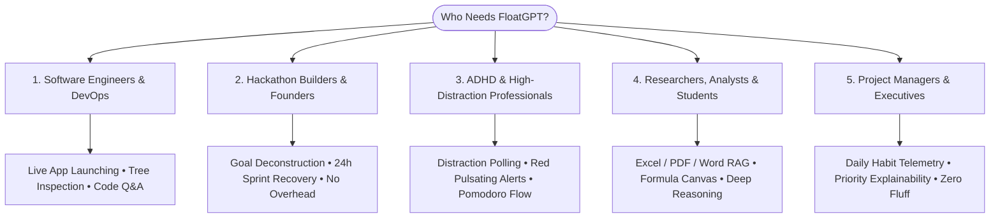

  
   
  <h1>FloatGPT — Feature & Capability Master Atlas</h1>
  
<b>Version 2.1.2 • Comprehensive Architectural, System & Feature Specification</b>

  
<i>The Autonomous, Omnipotent OS Companion for Calm Execution, Deep Focus & Desktop Automation across Windows & macOS</i>

---

## 📑 Master Table of Contents

1. [🧭 Mission & Core Philosophy](#1--mission--core-philosophy)
2. [👥 Who Is FloatGPT For? (Target Personas & Use Cases)](#2--who-is-floatgpt-for-target-personas--use-cases)
3. [⚙️ Native Cross-Platform OS Automation (macOS & Windows)](#3-️-native-cross-platform-os-automation-macos--windows)
4. [📅 Goal, Project & Task Planning Engine](#4--goal-project--task-planning-engine)
5. [🛡️ Digital Guardian, Focus Enforcer & Pomodoro Suite](#5-️-digital-guardian-focus-enforcer--pomodoro-suite)
6. [🎨 Screen Canvas & Live Drawing Overlay](#6-️-screen-canvas--live-drawing-overlay)
7. [🔑 Universal In-Panel AI Hub & Multi-Model Architecture](#7--universal-in-panel-ai-hub--multi-model-architecture)
8. [🎙️ Bilingual Voice Dictation & Audio Engine (English, Hindi, Hinglish)](#8-️-bilingual-voice-dictation--audio-engine-english-hindi-hinglish)
9. [📄 Enterprise Document RAG & Multimodal Vision Engine](#9--enterprise-document-rag--multimodal-vision-engine)
10. [🌐 The Playground Studio & Habit Analytics](#10-️-the-playground-studio--habit-analytics)
11. [🧠 Shared Memory Layer & Context Continuity](#11--shared-memory-layer--context-continuity)
12. [⌨️ Slash Commands & Global Summon Hotkey](#12-️-slash-commands--global-summon-hotkey)
13. [🎛️ Settings, Appearance & Customization Matrix](#13-️-settings-appearance--customization-matrix)
14. [🔒 Security, Safety Guardrails & Local-First Immutability](#14--security-safety-guardrails--local-first-immutability)

---

## 1. 🧭 Mission & Core Philosophy

Traditional productivity software is passive: it sits as a static tab in your browser, accumulates stale backlog items, and displays an overwhelming wall of red overdue alerts when you fall behind—triggering anxiety instead of driving action.

**FloatGPT** is fundamentally different:
- **It is an Execution Control Plane**: Docks directly onto your desktop as a lightweight, interactive floating Orb that summons instantly anywhere via `Ctrl + Shift + Space`.
- **It is Omnipotent & Native**: Interfaces directly with your local operating system—launching applications, checking system status, and executing safe routines natively on both Windows and macOS.
- **It is Self-Healing**: When deadlines slip, the **Autonomous Recovery Engine** reschedules non-critical work to protect your hard deliverables, automatically returning to `Healthy` once tasks are cleared.
- **It Protects Attention**: The **Digital Guardian** actively monitors distraction windows during Focus Mode, pulsing high-visibility warnings to drag you back to execution.
- **Design Standard**: Built for *"Calm Execution"*—no fake terminal theatrics, high-contrast readability, glassmorphic styling, and physics-driven Framer Motion animations.

---

## 2. 👥 Who Is FloatGPT For? (Target Personas & Use Cases)

### 1. 💻 Software Engineers, DevOps & Architects
- **Context-Switch Elimination**: Launch terminal environments, inspect directory sizes, or open documentation without leaving your active IDE.
- **Universal Documentation & RAG**: Drop dense API specs or PDF documentation into FloatGPT to query schemas, edge cases, and architectures instantly.
- **Zero-Friction Hotkey**: Tap `Ctrl + Shift + Space` to summon technical assistance over any editor or terminal.

### 2. ⚡ Hackathon Competitors, Agile Builders & Startup Founders
- **Natural Language Sprints**: Type *"I have 4 hours left: build demo, deploy backend, record video, submit README"*, and get a minute-by-minute execution timeline.
- **Self-Healing Recovery**: If step 1 takes 40 minutes longer than planned, FloatGPT recalculates your entire schedule without panic.
- **Deterministic Urgency ("Why?" Button)**: Clearly explains which task must be executed right now and why non-critical tasks were deferred.

### 3. 🎯 High-Output Knowledge Workers & Individuals with ADHD / Focus Challenges
- **Active Distraction Enforcement**: Background monitoring detects when you open distracting tabs (YouTube, Twitter/X, Reddit) during Focus sessions and triggers high-contrast alerts to break dopamine loops.
- **Conversational Firewall**: FloatGPT politely rejects idle small talk, persistently redirecting your attention back to your active task.
- **Visual Urgency Progression**: Dynamic color shifts (Safe Blue ➔ Watch Amber ➔ Warning Orange ➔ Critical Red).

### 4. 📚 Researchers, Financial Analysts & Academic Students
- **Deep Spreadsheet & Document Manipulation**: Create `.xlsx` spreadsheets, calculate averages and sums, insert Excel formulas, and format tables via conversational prompts.
- **Multimodal Visual Canvas**: Annotate lecture notes, code snippets, or financial graphs directly on screen using the **Screen Canvas Overlay**.
- **Historical Memory Retention**: Long-term context extraction stores formulas, preferences, and recurring research themes without bloating individual chat transcripts.

---

## 3. ⚙️ Native Cross-Platform OS Automation (macOS & Windows)

FloatGPT features a cross-platform OS orchestration layer that generates and executes safe, platform-native commands on the fly.

### macOS (Darwin) Subsystem:
* **Native App Launching**: Uses `open -a` and AppleScript for instant launch and window activation (Safari, Terminal, VS Code, Slack, Spotify, Apple Notes, System Settings, Finder).
* **Native Permissions**: Automatic microphone permissions initialized via `systemPreferences.askForMediaAccess('microphone')`.

### Windows (Win32) Subsystem:
* **PowerShell & UWP Execution**: Direct execution of PowerShell and UWP URI protocols (`wt`, `notepad`, `calc`, `explorer`, `msedge`, `chrome`, `code`, `ms-settings:`).
* **Main Process Security Firewall**: Strict regex inspection blocks destructive commands (`Remove-Item -Recurse`, `diskpart`, `format`, `netsh advfirewall off`, etc.).

---

## 4. 📅 Goal, Project & Task Planning Engine

* **Natural Language Deconstruction**: Transforms vague prompts into structured Goals, Projects, and granular subtasks.
* **Strict Immutability Guarantee**: Once marked `Completed` or `Archived`, tasks stay permanently completed. Startup sync merging (`SyncMerger`) ensures tasks are never reversed or lost upon application restarts.
* **Live Urgency Countdown**: Unix-timestamp-driven timers with Safe, Watch, Warning, and Emergency indicators.
* **Inline Task Actions**: One-click `Done`, `Clear Done` (per-project space reclamation), and `Why?` explainability popovers.

---

## 5. 🛡️ Digital Guardian, Focus Enforcer & Pomodoro Suite

* **Background Distraction Monitor**: Cross-checks foreground window titles against a user-customizable blocklist.
* **Calibrated In-App Floating Orb Alerts**: Replaces intrusive native OS toasts with minimal in-app Deadline Cloud Pills (strictly firing at 1 hour and 10 minutes remaining, auto-dismissing after 5 seconds).
* **Integrated Pomodoro Timer**: Seamlessly cycles between Work (25m), Short Break (5m), and Long Break (15m) sessions with smooth circular progress animations.

---

## 6. 🎨 Screen Canvas & Live Drawing Overlay

* **Interactive Display Whiteboard**: Toggle via the 🖌️ header button or `/draw` slash command.
* **Multi-Tool Palette**: Pen, Arrow (architecture callouts), Highlighter, Line, Eraser, and Clear Canvas.
* **Click-Through Support**: Transparent overlay floats above IDEs, terminals, and presentations without intercepting underlying clicks when hidden.

---

## 7. 🔑 Universal In-Panel AI Hub & Multi-Model Architecture

FloatGPT defaults to **Groq `GPT OSS 20B` (`openai/gpt-oss-20b`)** for sub-300ms inference, with instant selection across verified, high-throughput frontier models:

| Provider | Active Production Models | Key Features |
| :--- | :--- | :--- |
| **Groq (Default)** | `openai/gpt-oss-20b` (Default) `openai/gpt-oss-120b` `llama-3.3-70b-versatile` `llama-3.1-8b-instant` `deepseek-r1-distill-llama-70b` | Ultra-fast inference (<300ms), Llama 3.3 Flagship & DeepSeek R1 reasoning. |
| **Google Gemini** | `gemini-2.5-flash` `gemini-2.5-pro` `gemini-2.0-flash` `gemini-1.5-pro` `gemini-1.5-flash` | Multimodal vision analysis, Google Search Grounding & large context window. |
| **OpenAI** | `gpt-4o` `gpt-4o-mini` `o3-mini` `o1` | STEM reasoning, precision planning & conversational fluency. |
| **Anthropic** | `claude-3-7-sonnet-20250219` `claude-3-5-haiku-20241022` | Claude 3.7 Sonnet Hybrid Reasoning & Claude 3.5 Haiku Ultra-Fast. |

---

## 8. 🎙️ Bilingual Voice Dictation & Audio Engine (English, Hindi, Hinglish)

* **Groq Whisper Large-v3 Integration**: Fast speech-to-text dictation directly into the chat composer.
* **Targeted Bilingual Vocabulary Prompts**: Passes tailored vocabulary hints to Whisper, preventing multilingual audio from misclassifying into Urdu/Arabic script and ensuring clean Latin English or standard Hindi.
* **Cross-Platform Audio Streaming**: Native support for `audio/webm;codecs=opus`, `audio/mp4`, `audio/aac`, `audio/ogg`, and `audio/wav`.

---

## 9. 📄 Enterprise Document RAG & Multimodal Vision Engine

* **Supported Formats**: `.pdf`, `.docx`, `.xlsx`, `.csv`, `.txt`, `.md`, `.json`, `.png`, `.jpg`, `.webp`.
* **MiniSearch Inverted Indexing**: Local-first vector-free retrieval ensuring instantaneous document queries with zero network transmission.
* **Structured Spreadsheets**: Directly calculates cell sums, averages, and row queries from uploaded `.xlsx` files.

---

## 10. 🌐 The Playground Studio & Habit Analytics

Accessible via browser (`http://localhost:5173`):
* **Execution Telemetry**: Calculates completion rates, plan accuracy percentages, and peak productivity windows.
* **Isolated Transcripts**: Playground conversations remain isolated from the Desktop Orb while sharing the long-term memory layer.
* **API Key & Build Center**: Configure provider keys and download `.exe` / `.dmg` installers.

---

## 11. 🧠 Shared Memory Layer & Context Continuity

* **Habit Reflection Service**: Distills user preferences (*"Prefers concise TypeScript responses"*, *"Working on Amazon interview prep"*) from completed tasks.
* **Zero Transcript Bloat**: Stores high-value insights in permanent IndexedDB/Firestore memory without consuming chat context tokens.

---

## 12. ⌨️ Slash Commands & Global Summon Hotkey

* **`/plan [objective]`**: Instantly generates mathematical milestones and projects.
* **`/summarize`**: Condenses conversation into key action items.
* **`/explain [topic]`**: Generates in-depth technical breakdowns.
* **`/diagram [flow]`**: Renders interactive Mermaid diagrams.
* **`/draw`**: Launches the live screen drawing canvas.
* **`Ctrl + Shift + Space`**: Global instant toggle to summon or conceal the floating Orb over any desktop window.

---

## 13. 🎛️ Settings, Appearance & Customization Matrix

* **Density Modes**: Toggle between Comfortable and Compact UI scaling.
* **Visual Aesthetics**: Circular vs. Squircle geometry, glow intensities, opacity sliders, and scale multipliers.
* **Accessibility**: Full High-Contrast Mode and Reduced Motion toggles.

---

## 14. 🔒 Security, Safety Guardrails & Local-First Immutability

* **$t=0\text{ ms}$ Local-First Persistence**: Instant synchronous writes to IndexedDB (`idb-keyval`) ensure zero data loss on sudden termination or reload.
* **Destructive Command Interception**: Main process firewall strictly blocks malicious or unauthorized OS deletions.
* **Multi-Surface Sync Protection**: `SyncMerger` prevents stale cloud snapshots from ever unchecking completed tasks or overriding local progress.

---

  <h3>FloatGPT v2.1.2 — PLAN. EXECUTE. RECOVER.</h3>
  
<i>Engineered for peak focus, deep work, and calm execution across macOS and Windows.</i>

