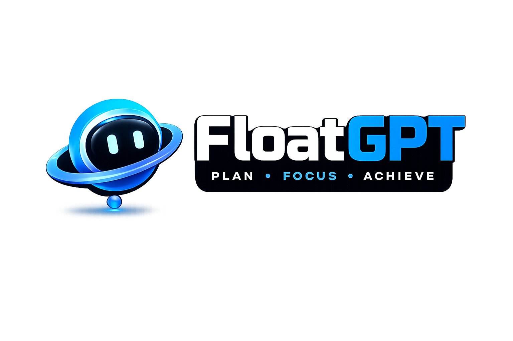

<div align="center">
  

  <br />
  <br />

  <p><b>PLAN! EXECUTE! RECOVER!</b></p>

  <p>
    
    
    
    
  </p>
</div>

<br />

**FloatGPT** is a *persistent, autonomous AI Execution Companion* you run on your own devices. It sits flawlessly on your desktop, acting as a suite of invisible intelligence engines. Instead of a standard browser tab, FloatGPT acts as a real-time control plane for your entire workflow. 

If you want an intelligent, deeply integrated assistant that feels local, fast, and relentlessly focused on keeping you on track, this is it.

It dynamically transforms scattered thoughts, vague goals, and looming deadlines into highly structured execution plans. Out of the box, it defaults to **Groq (Llama 3.3 70B)** for lightning-fast reasoning, but also natively supports **Anthropic (Claude 3.5)**, **OpenAI (GPT-4o)**, and **Google (Gemini Pro/Flash)**.

---

## ✨ Why FloatGPT?

Traditional task managers are static. They require constant manual grooming, lack context, and leave you to figure out *what* to do next. When you fall behind, they just show a sea of red, inducing anxiety rather than helping you recover.

**FloatGPT changes this paradigm:**
- **It is proactive:** You chat with it, and it autonomously builds mathematical, prioritized plans.
- **It is self-healing:** If you miss a deadline, the **Recovery Engine** automatically reschedules non-critical tasks to protect your hard deadlines.
- **It is transparent:** The **Explainability Engine** tells you *exactly* why a task is prioritized right now.
- **It protects your attention:** **Focus Mode** and the integrated **Pomodoro Engine** strip away the noise and show you the single most important action to take.
- **It lives where you work:** A beautifully animated, non-intrusive floating orb docks to your screen. Summon it instantly from anywhere using `Ctrl + Shift + Space`.

---

## 🧠 Core Intelligence Engines

FloatGPT is powered by a Unified Intelligence Copilot that acts as multiple specialized agents:

* **Planning & Goal Agent**: Breaks down high-level, natural language objectives into structured Projects, Tasks, and milestones with precise time-zone aware deadlines.
* **Time & Guardian Engine**: Uses real-time Unix timestamps to drive a flawless, live countdown system. Visual urgency indicators (Safe -> Watch -> Warning -> Critical) escalate automatically. If a task enters a strictly monitored `[-10m, +10m]` "Extreme Deadline" window, the Guardian safely overrides the UI, pulsating the orb with elegant Framer Motion animations to grab your attention.
* **Autonomous Recovery Engine**: When you fall behind, the system intelligently defers "soft" tasks to tomorrow and highlights a critical path to get you back on track without overwhelming you.
* **Transparent Explainability (The "Why?" Engine)**: Every prioritized task features an inline "Why?" button giving you deterministic reasoning (e.g., *"This task is first because it is due in 42 minutes and blocks your next step."*)
* **Habit & Reflection Agent**: Analyzes your execution patterns to tailor your focus windows, adapting to your strongest productivity periods.
* **Strict Credential Isolation (Enterprise Grade)**: Ensures complete separation between developer system functions (like the Playground) and the user's runtime. The Playground exclusively uses a developer-scoped environment key, protecting the user's personal API keys from internal system requests.

---

## 🖥️ What's Inside? (Features & UX)

FloatGPT is designed for power-users, featuring deep OS integration and maximum customizability.

* **Mission Control (Home)**: Your centralized dashboard. It isolates time-critical tasks (due under 24 hours), separates strategic priorities, and flags active risks (e.g., "Missing API Key") before they become blockers.
* **Focus Engine (Pomodoro)**: A fully functional, mathematically precise Pomodoro timer built directly into the Focus panel. It automatically cycles between your custom Work and Break intervals, shifting colors to keep you anchored.
* **Deep Personalization**: Toggle Layout Density (Comfortable vs Compact scaling), High Contrast Mode, and Reduced Motion for a completely tailored, distraction-free environment.
* **Dual-Mode Interaction**: Seamlessly toggle between "Plan Mode" (where the AI actively manages your state) and standard Chat mode. Override the AI's core instructions using the **System Persona** setting.
* **Local-First Privacy**: Built on top of local storage for zero-latency interactions. Your state never leaves your machine unless explicitly sent to the AI for planning.

---

## 🏗️ Architecture & Tech Stack

FloatGPT operates on a custom, highly-optimized full-stack setup:

* **Frontend:** React 19 & Vite for an ultra-fast UI.
* **Desktop Wrapper:** Electron packages the application into a native desktop widget with custom click-through constraints, global OS hotkeys, aggressive Windows DWM sleep/wake recovery, and transparent background rendering. The production build is deeply optimized, resulting in a lightweight `~92MB` executable.
* **Styling:** Tailwind CSS v4 & Framer Motion for sleek, purposeful layout animations and complex visual states.
* **Validation:** Zod schemas with custom mathematical `dateTransforms` to flawlessly parse LLM outputs into strictly typed execution graphs.

---

## 🚀 Setup Guide

Want to run FloatGPT locally? It takes less than 2 minutes. 

### Prerequisites
* Node.js (v20+ recommended)
* An API Key (Google Gemini, OpenAI, or Groq)

### 1. Install & Configure
Clone the repository and install dependencies:
```bash
git clone <repository-url>
cd floatgpt
npm install
```

### 2. Run the FloatGPT Desktop App
Start the development server from the root directory. This will boot both the Vite frontend and the transparent Electron wrapper:
```bash
# Ensure you are in the root directory (floatgpt/)
npm run dev
```

### 3. Run the FloatGPT Web Playground Studio
If you want to run the full-screen web playground (the website where users manage personas, habits, and download the app), you need to run its dedicated client and server:

**Start the Playground Backend:**
The Playground strictly relies on a developer environment key for its internal intelligence (to protect user keys). 
Before starting, create a `.env` file in the root directory (or `playground/server/`) with your developer key:
`GROQ_API_KEY=your_key_here`

```bash
cd playground/server
npm install
npm run dev
# Runs on http://localhost:5000
```

**Start the Playground Frontend:**
```bash
cd playground/client
npm install
npm run dev
# Runs on http://localhost:5173
```

### 4. Build Production Installers (.exe / .dmg)
To generate downloadable installation files for your users:
```bash
# Ensure you are in the root directory (floatgpt/)
npm run pack:win   # For Windows (.exe)
npm run pack:mac   # For macOS (.dmg)
```
The resulting installers will be placed in the `release/` folder.

### 5. How to Test (Demo Script)
1. **Chat**: Open FloatGPT and say, *"I have a hackathon submission due in 4 hours. I need to record a demo video, write the README, and deploy the app."*
2. **Watch it Plan**: Switch to the **Plan** tab to see how it structured your goal, assigned time-zone perfect deadlines, and created tasks.
3. **Trigger the Guardian**: Say *"Actually, the README is due in 5 minutes."* Watch the floating orb instantly transition into a premium red pulsating glow.
4. **Focus & Execute**: Go to the **Focus** tab, start the Pomodoro Timer, and execute your critical path.
5. **Summon**: Press `Ctrl + Shift + Space` to hide and show the app instantly from anywhere on your OS.

---

## 🎨 Design Philosophy: "Calm Execution"

FloatGPT is designed for high-stakes environments. 
- **No Tech-Larping**: No fake terminal logs, no unnecessary system coordinates. 
- **Intentional Attention**: Colors are muted by default. Vibrant warnings (Red/Orange) are reserved *strictly* for when a deadline genuinely requires immediate intervention. 
- **Clarity**: Spacing, margins, and typography (Inter & Space Grotesk) are deliberately paired to create visual hierarchy and reduce cognitive load.
