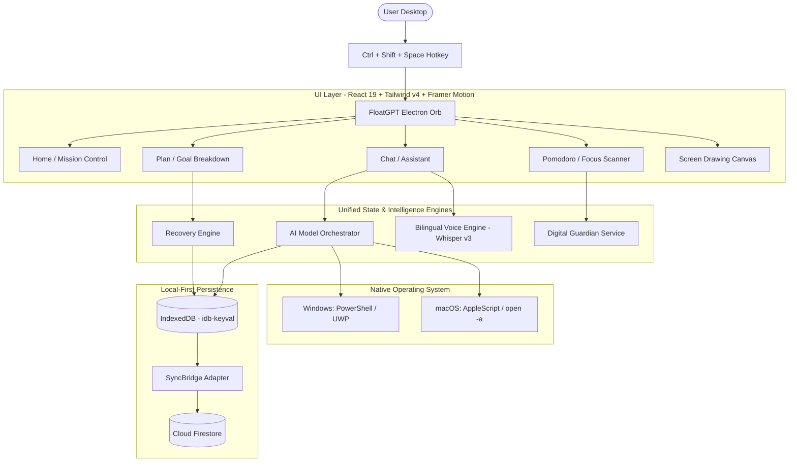

<div align="center">
  
  <br />
  <p><b>PLAN! EXECUTE! RECOVER!</b></p>
  <p>
    
    
    
    
  </p>
</div>

<div align="center">
  
</div>

**FloatGPT** is a *persistent, autonomous AI Execution Companion* that runs natively on your macOS and Windows desktop. It docks as a sleek, non-intrusive floating Orb, serving as a zero-latency control plane for your daily goals, OS automation, deep work sprints, and real-time execution.

Instead of another passive browser tab or static to-do list, FloatGPT actively plans your day, launches native applications, polices digital distractions, handles voice dictation (English & Hindi/Hinglish), and automatically reschedules deadlines when drift occurs.

Out of the box, it defaults to **Groq (GPT OSS 20B)** for sub-300ms ultra-fast reasoning, with seamless support for **Google (Gemini 2.5 Flash / Pro)**, **OpenAI (GPT-4o / o3-mini)**, **Anthropic (Claude 3.7 Sonnet)**, and **DeepSeek (R1 Distill 70B)**.

---

## 📑 Table of Contents

- [👥 Who Can Use FloatGPT & Why It Is Beneficial](#-who-can-use-floatgpt--why-it-is-beneficial)
- [🎯 Real-World Use Cases (When & How to Use)](#-real-world-use-cases-when--how-to-use)
- [🧠 Core Intelligence Engines](#-core-intelligence-engines)
- [🖥️ Feature & UI Highlights](#️-feature--ui-highlights)
- [🏗️ Architecture & Tech Stack](#️-architecture--tech-stack)
- [🚀 Quick Start & Setup Guide](#-quick-start--setup-guide)
- [📦 Packaging & Distribution (.exe & .dmg)](#-packaging--distribution-exe--dmg)
- [🎨 Design Philosophy: "Calm Execution"](#-design-philosophy-calm-execution)

---

## 👥 Who Can Use FloatGPT & Why It Is Beneficial

| Persona | Core Pain Point Solved | Key Benefit with FloatGPT |
| :--- | :--- | :--- |
| **💻 Software Engineers & DevOps** | Constant context switching between IDE, terminal, and browser tabs | Summon terminal scripts, launch tools, and query technical docs over any window via `Ctrl + Shift + Space`. |
| **⚡ Startup Founders & Sprint Builders** | Managing tight 24-hour delivery deadlines with high uncertainty | Conversational goal decomposition into structured milestones with self-healing recovery when deadlines slip. |
| **🎯 High-Output Professionals & ADHD Focusers** | Falling into social media dopamine loops and getting derailed | The **Digital Guardian** actively monitors window titles, forcefully alerting and shaking the Orb upon distraction violations. |
| **📚 Researchers, Analysts & Students** | Handling dense PDFs, notes, and complex reasoning simultaneously | Universal document analysis, screen annotation canvas, and bilingual speech-to-text dictation. |
| **🏢 Project Managers & Team Leads** | Disjointed task tracking and unexplainable priority decisions | Deterministic task explainability ("Why?" engine) paired with immutable local-first completion tracking. |

---

## 🎯 Real-World Use Cases (When & How to Use)

### 1. 🚀 Sprint Planning & Hackathon Execution
* **When**: You have a tight deadline (e.g. *"Hackathon demo due in 4 hours"*).
* **How**: Open the chat and say *"I need to build the API, record the demo video, write the README, and deploy to Vercel in 4 hours."*
* **Benefit**: FloatGPT creates a prioritized plan with live countdown timers, warns you at 1 hour and 10 minutes before deadlines, and automatically defers non-critical steps if you get delayed.

### 2. 🛡️ Deep Work Focus & Distraction Guard
* **When**: You need to sit down for a 50-minute coding or writing block.
* **How**: Click the **Pomodoro** icon, select your work interval, and begin.
* **Benefit**: If you wander off to YouTube, Twitter/X, or Reddit during your sprint, the Digital Guardian detects the active window and triggers a high-visibility red pulsating alert to snap your attention back to your task.

### 3. 🎙️ Hands-Free Bilingual Voice Dictation
* **When**: You want to capture thoughts, tasks, or prompt instructions quickly without typing.
* **How**: Tap the microphone icon and speak in English, Hindi, or Hinglish (*"Kaise ho, please schedule system design review for 5 PM"*).
* **Benefit**: Uses Groq Whisper Large-v3 with targeted bilingual vocabulary hints, ensuring instant, accurate text without script misclassifications.

### 4. 💻 Native Desktop & OS Command Orchestration
* **When**: You want to launch apps or trigger OS routines without manual clicking.
* **How**: Type *"Open Visual Studio Code and Spotify"* or *"Launch System Settings"*.
* **Benefit**: On **macOS**, uses native `open -a` and AppleScript; on **Windows**, executes secure PowerShell scripts with safety firewalls protecting system files.

---

<div align="center">
  
</div>

---

## 🧠 Core Intelligence Engines

* **Goal & Plan Deconstruction Agent**: Breaks abstract objectives into mathematical projects and tasks with time-zone-aware deadlines.
* **Self-Healing Recovery Engine**: Analyzes task delays in real-time. If non-critical tasks are missed, it reschedules them without anxiety, automatically resetting back to `Healthy` once the queue is clear.
* **Digital Guardian (Focus Scanner)**: Background polling engine that watches active application titles against customizable distraction blocklists.
* **Calibrated In-App Deadline Alerts**: Minimal, non-intrusive floating pill alerts that fire strictly at **1 Hour** (Yellow Warning) and **10 Minutes** (Red Urgent) with a 5-second auto-dismiss. Zero native OS notification spam.
* **Universal Model Router**:
  * **Groq**: `openai/gpt-oss-20b` (Default), `openai/gpt-oss-120b`, `llama-3.3-70b-versatile`, `llama-3.1-8b-instant`, `deepseek-r1-distill-llama-70b`.
  * **Google Gemini**: `gemini-2.5-flash`, `gemini-2.5-pro`, `gemini-2.0-flash`, `gemini-1.5-pro`.
  * **OpenAI**: `gpt-4o`, `gpt-4o-mini`, `o3-mini`, `o1`.
  * **Anthropic**: `claude-3-7-sonnet-20250219`, `claude-3-5-haiku-20241022`.
* **Explainability ("Why?") Engine**: Every task card includes a deterministic "Why?" inspection popover detailing priority score, dependency readiness, and time criticality.
* **Screen Canvas Overlay**: Live annotation layer allowing you to draw freehand diagrams, highlight UI elements, and screenshot active contexts for multimodal AI analysis.

---

## 🖥️ Feature & UI Highlights

* **Desktop Floating Orb (Electron)**: Sleek, draggable circular widget with Framer Motion physics, collapsible side panels, and global summon hotkey (`Ctrl + Shift + Space`).
* **Web Playground Studio**: Dedicated browser workspace (`http://localhost:5173`) for reviewing habit telemetry, exploring past sessions, managing API keys, and downloading desktop builds.
* **Local-First Privacy Architecture**: Instant writes to IndexedDB (`idb-keyval`) at $t=0\text{ ms}$ ensure completed tasks and notes are never lost or rolled back, even on sudden app termination or restart.
* **Multi-Surface SyncBridge**: Seamless real-time synchronization between the Desktop Orb and Web Playground with strict transcript isolation.

---

## 🏗️ Architecture & Tech Stack


```mermaid
graph TD
    User([User Desktop]) --> Hotkey[Ctrl + Shift + Space Hotkey]
    Hotkey --> Orb[FloatGPT Electron Orb]
    
    subgraph Frontend [UI Layer - React 19 + Tailwind v4 + Framer Motion]
        Orb --> Home[Home / Mission Control]
        Orb --> Plan[Plan / Goal Breakdown]
        Orb --> Chat[Chat / Assistant]
        Orb --> Focus[Pomodoro / Focus Scanner]
        Orb --> Canvas[Screen Drawing Canvas]
    end

    subgraph Core [Unified State & Intelligence Engines]
        Plan --> Recovery[Recovery Engine]
        Focus --> Guardian[Digital Guardian Service]
        Chat --> Orchestrator[AI Model Orchestrator]
        Chat --> Voice[Bilingual Voice Engine - Whisper v3]
    end

    subgraph Storage [Local-First Persistence]
        Recovery --> IDB[(IndexedDB - idb-keyval)]
        Orchestrator --> IDB
        IDB --> Bridge[SyncBridge Adapter]
        Bridge --> Firebase[(Cloud Firestore)]
    end

    subgraph OS [Native Operating System]
        Orchestrator --> WinOS[Windows: PowerShell / UWP]
        Orchestrator --> MacOS[macOS: AppleScript / open -a]
    end
```

---

## 🚀 Quick Start & Setup Guide

### 1. Prerequisites
- **Node.js**: `v20+` recommended
- **API Key**: Any supported provider (Groq, Google Gemini, OpenAI, or Anthropic)

### 2. Clone & Install
```bash
git clone https://github.com/Maayank18/FloatGPT.git
cd FloatGPT
npm install
```

### 3. Configure API Keys
Create a `.env` file in the project root:
```env
# Choose any provider (Groq is recommended for free & ultra-fast inference)
GROQ_API_KEY=gsk_your_groq_api_key_here
GEMINI_API_KEY=AIzaSy_your_gemini_key_here
OPENAI_API_KEY=sk-proj_your_openai_key_here
ANTHROPIC_API_KEY=sk-ant_your_anthropic_key_here
```

### 4. Run Locally
```bash
# Boots the transparent Electron Desktop Orb and local server
npm run dev
```

---

## 📦 Packaging & Distribution (.exe & .dmg)

FloatGPT includes automated build scripts for native Windows and macOS distribution:

```bash
# Build Windows Installer (.exe)
npm run pack:win

# Build macOS Disk Image (.dmg)
npm run pack:mac
```

Generated installer packages will be placed in the `release/` directory:
- **Windows**: `release/FloatGPT Setup 2.1.2.exe`
- **macOS**: `release/FloatGPT-2.1.2.dmg`

---

## 🎨 Design Philosophy: "Calm Execution"

FloatGPT is built for deep knowledge workers operating under real deadlines:
- **Zero Tech-Theatrics**: No fake green matrix text or pseudo-terminal noise.
- **Intentional Color Usage**: Calming dark backgrounds (`#0a0d14`), with vibrant amber and red reserved exclusively for genuine deadline warnings.
- **Micro-Animations**: Smooth, physical springs powered by Framer Motion.
- **Accessibility & Density**: Customizable comfortable vs compact spacing, high contrast, and reduced motion modes.
