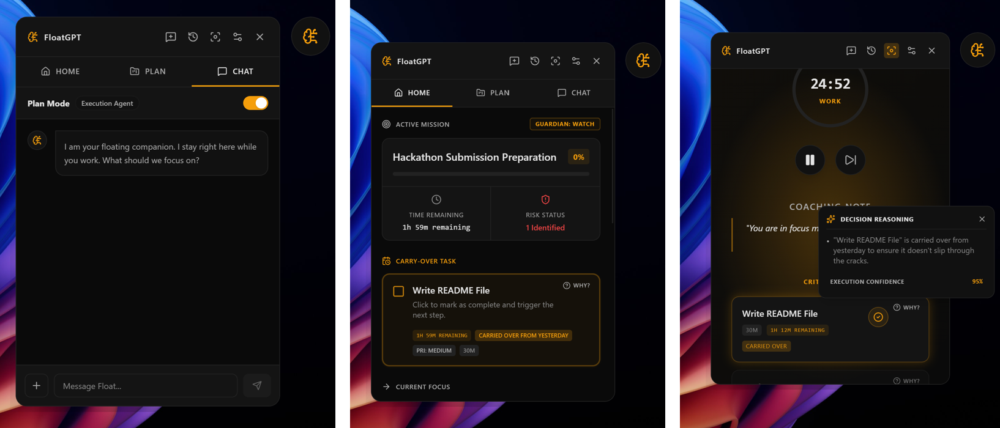
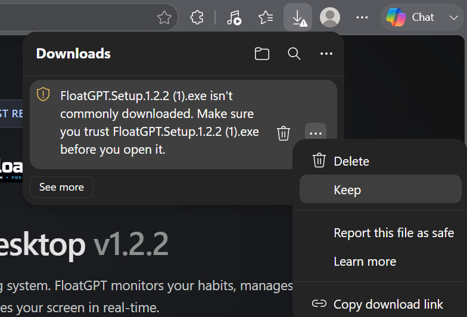
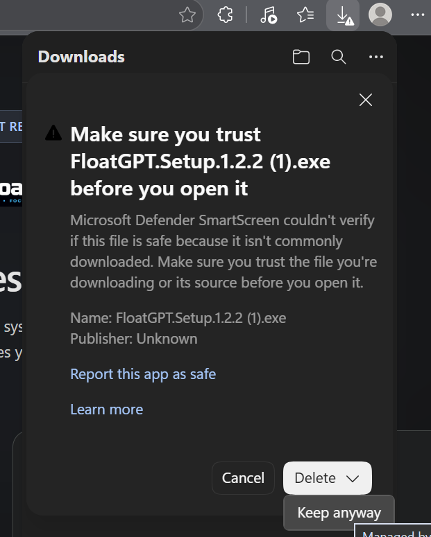

<div align="center">
  

  <p><strong>A floating desktop assistant for Windows.</strong></p>
  <p>It stays on the screen. Ask in English or Hinglish, and the answer stays in the chat.</p>

  <p>
    
    
  </p>

  <p>
    <a href="https://floatgpt.vercel.app/">Open the site</a>
    ·
    <a href="https://github.com/Maayank18/FloatGPT/releases/download/v2.2.0/FloatGPT.Setup.2.2.0.exe">Download for Windows</a>
    ·
    <a href="https://github.com/Maayank18/FloatGPT">Star the repo</a>
  </p>
</div>

<div align="center">
  
</div>

FloatGPT is an orb on the desktop. It sits over your other windows, and `Ctrl+Shift+Space` brings it back from anywhere. The [Playground](https://floatgpt.vercel.app/) is the browser side: plans, API keys, the Guide, and the download.

## What you can ask it to do

| You say | What happens |
| --- | --- |
| Open Edge, Settings, or a file on the desktop | The app opens. If it is already open, that window comes forward. |
| What is on my screen? | The reply names the real window behind the orb. |
| How much memory is in use? | The number comes back in the chat, including the GB figure. |
| Type this into the window behind you | The text is pasted there, then the orb returns. |
| Hold the mic, or hold right-click on the orb | You speak. The answer is spoken back. The mic is not left on. |
| Keep this PDF, then ask about it later | The file stays available. A file you close stays closed. |
| Switch on Plan | Goals and tasks are laid out. Chat is the default. Plan is opt-in. |
| Start a new chat | That thread stays its own. It does not overwrite the others. |

Plans and settings follow the account. Chats and API keys stay on the device that wrote them.

## How it is put together

| Layer | What it does |
| --- | --- |
| Floating orb | Electron window. React interface. Draggable, always on the desktop, summoned with `Ctrl+Shift+Space`. |
| Playground | The site and the local studio. Sign-in, plans, keys, Guide, and the Windows download. |
| On this PC | Fast local reads and writes with IndexedDB. Chats are saved on the device first. |
| Account | Email or Google. Plans, tasks, and settings are stored for that account. Chat text and API keys are left out. |
| Models | No key: Qwen 3.5 9B through Ollama on this PC. Or bring a Groq, Gemini, OpenAI, or Anthropic key. |
| Desktop actions | A request to open an app or read this PC runs on Windows. Deleting system files and formatting a drive are blocked. |
| Focus guard | Watches the active window title. A title on your blocklist pulls the orb back into view. |

Opening an app or reading this PC does not need a model. A cloud key is used only when that chat is set to a cloud provider.

## Install and run

### Windows app

[Download FloatGPT.Setup.2.2.0.exe](https://github.com/Maayank18/FloatGPT/releases/download/v2.2.0/FloatGPT.Setup.2.2.0.exe)

Windows 10 or 11, 64-bit. The installer is about 100 MB. If SmartScreen says the app is unrecognized, choose **More info**, then **Run anyway**.

<div align="center">
  
  
</div>

The same download, Guide, and sign-in are at [floatgpt.vercel.app](https://floatgpt.vercel.app/).

### On your own PC

Node.js 20 or newer. For chat with no API key, also install [Ollama](https://ollama.com). Ollama does not need an account.

> [!NOTE]
> `npm install` installs the project packages. It does not install Ollama or the model. The model stays on disk after you close the terminal.

**Once**

```bash
git clone https://github.com/Maayank18/FloatGPT.git
cd FloatGPT
ollama pull qwen3.5:9b
npm install
```

Qwen 3.5 9B is about 6.6 GB. A PC with 8 GB of RAM can run it. 16 GB is easier.

**Every later start**

```bash
npm run dev
```

That opens the orb and the Playground. Stop it with `Ctrl+C`. The next start is `npm run dev` again.

**A cloud key, if you want one**

Create a `.env` file in the project root. One key is enough. Keys stay on the device where you enter them.

```env
VITE_GROQ_API_KEY=your_groq_key
VITE_GEMINI_API_KEY=your_gemini_key
VITE_OPENAI_API_KEY=your_openai_key
VITE_ANTHROPIC_API_KEY=your_anthropic_key
```

**Build the installer**

```bash
npm run pack:win
```

The file is written to `release/` as `FloatGPT Setup 2.2.0.exe`.

## License

FloatGPT is proprietary software. All rights reserved. Designed and developed by Mayank Garg.
